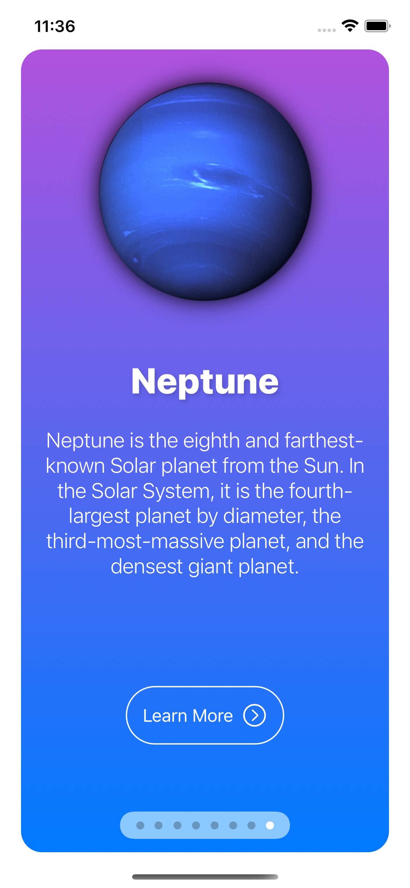
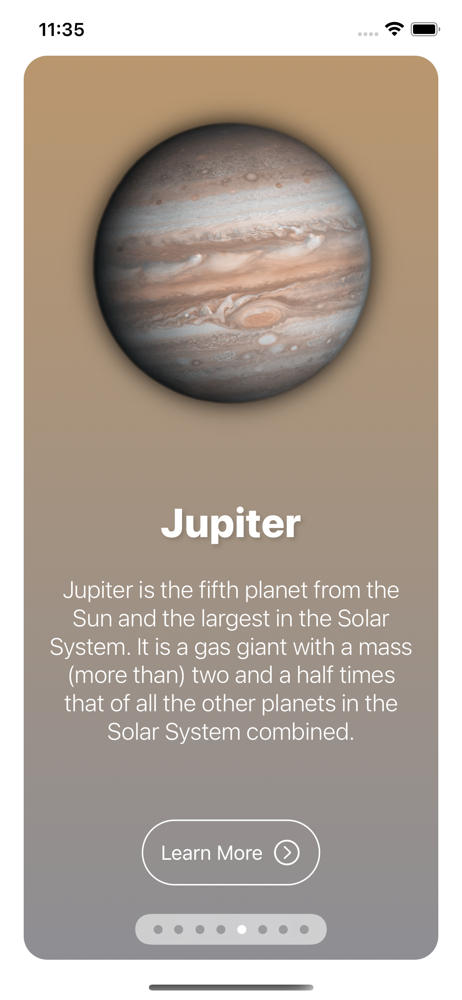
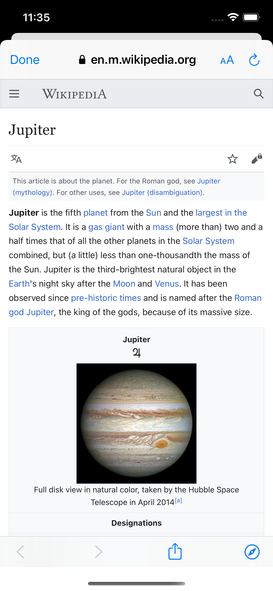

# SwiftUI-Planets
A small app built with SwiftUI showcasing planets in our solar system.

### What I Learned ###
* How to implement a TabView to navigate through different views.
* How to manage different stacks for creating the UI such as ZStack and VStack.
* How to create a custom button design by creating a view for it.
* How to use SFSafariViewController in SwiftUI through UIViewControllerRepresentable.
* How to present the SafariView modally which takes the user to a Wikipedia article of the corresponding planet for more information.
* How to use various modifiers to create a neat UI.

### Screenshots ###

